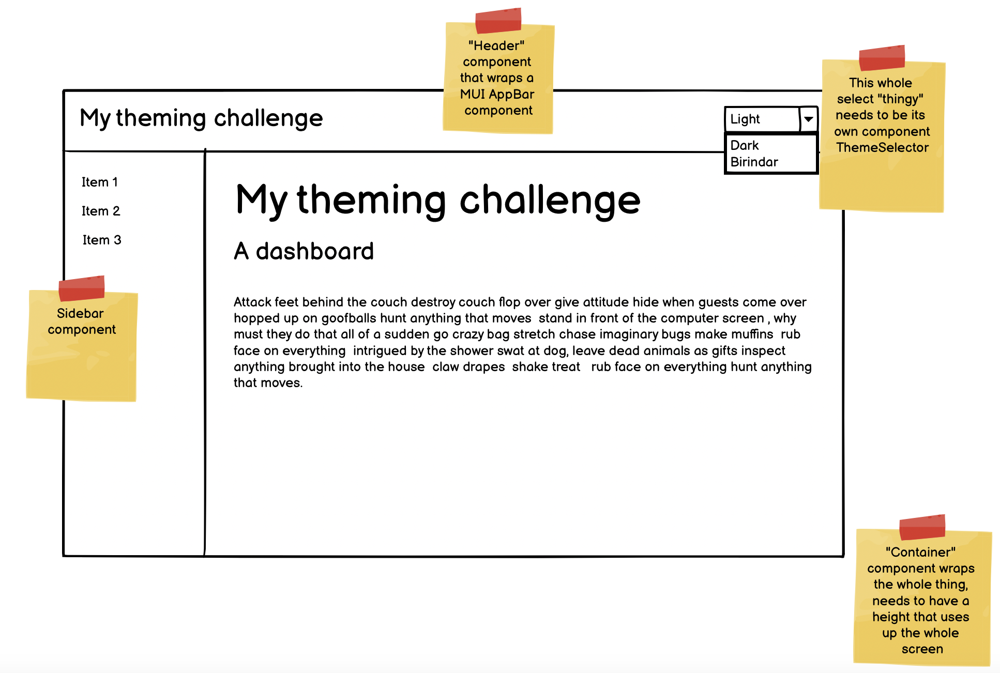
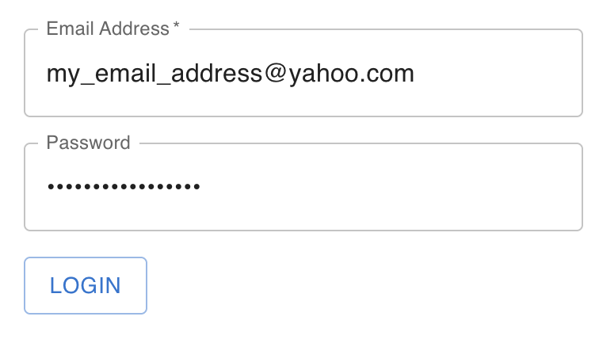

## Welcome to the Dashboard exercise!

### What will I learn from this challenge?

- React Fundamentals
  - General concepts about theming (using styled component theming)
  - useContext hook
  - Provider pattern and how to use it to avoid prop drilling
  - Using TS maps for build time configuration checking

## The Task

- Create a dashboard to look like:
  

  - Don't try and wire the context up yet, I will show you how to do that
  - Implement styles using the themes defined in `./themes/themes.ts`. So, instead of:
    `color:red`\
     use:\
     `color: ${({ theme }) => theme.text};`
    this means the UI will change color when you change the theme provider from:\
    `<ThemeProvider theme={light}>`
    to\
    `<ThemeProvider theme={dark}>`
  - Don't try and connect the `ThemeSelector` component to anything yet, just connect it to a local `useState`
  - Don't overly gold plate it, just do something that resembles the wireframe and make sure when swap from `light` to `dark` that the display changes

  ## And when I'm done?

  - Email to Duncan sans `node_modules` and then we'll go through the context together. Then you'll be trying to do it yourself. Fun times await!

## Dashboard - (Part 2)

### 1. Put in the routing

Use react router (https://reactrouter.com/) to put in the following routes

- `/home`
- `/login`
- `/transactions`
- `/admin`

That will call relevant components for each URL:

- `HomePage.tsx`
- `LoginPage.tsx`
- `TransactionsPage.tsx`
- `AdminPage.tsx`

`BREAKPOINT`: chat with Duncan

### 2. Implement Login Page

Make it look like this:


As the user adds stuff, have onblur validation on both of the text boxes.

#### Email Address box

- should show error on blur if
  - email is blank string
  - fails email regex validation

#### Password box

- should show error on blur if
  - password is blank string
  - password is less that 4 characters (minimum length)

#### Login result

- Call the endpoint:
  `POST /accounts/login`
  with an example body:

```
{
    "email":"MiguelBBingham@rhyta.com",
    "password":"miguel"
}
```

There are 3 users:

```
EricaCEdwards@jourrapide.com (User)
MiguelBBingham@rhyta.com (User)
NoraDPoole@dayrep.com" (Admin & User)
```

with the password being the lowercase first name of all the users.

If the post returns success and a token then you have succeeded, time to contact Duncan, now the real fun begins!
